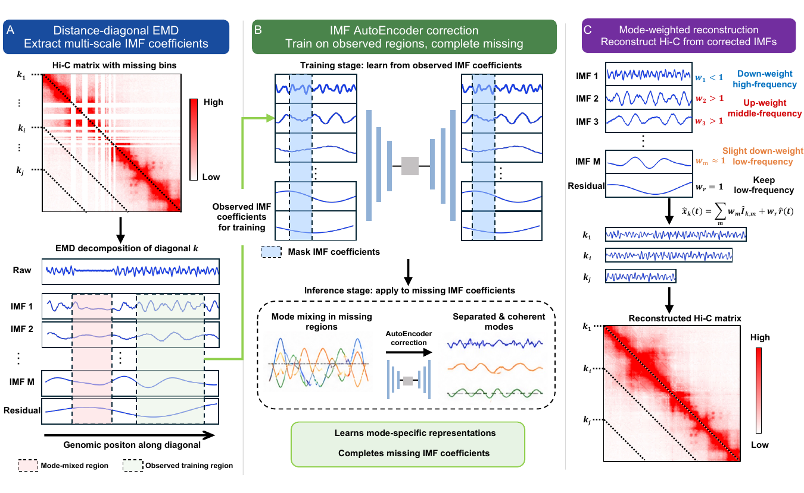

# EMMA

EMMA is an EMD-guided restoration toolkit for chromatin interaction maps. It restores complete or low-quality genomic-bin regions in Hi-C, Pore-C, and contact-like 3D genome matrices by combining distance-diagonal signal decomposition, masked IMF autoencoder correction, and mode-weighted reconstruction.



## What EMMA Does

EMMA supports three common workflows:

- Restore known missing regions from a user-provided mask.
- Automatically detect low-coverage or missing genomic bins, then restore them.
- Reconstruct or lightly enhance a contact matrix without an explicit missing mask.

The restore mode keeps observed entries unchanged and only replaces entries marked by the imputation mask.

## Installation

Clone the repository and install it in editable mode:

```bash
git clone <this-repository-url>
cd EMMA
pip install -e .
```

For development and tests:

```bash
pip install -e ".[dev]"
```

Core dependencies include `numpy`, `scipy`, `torch`, `cooler`, `EMD-signal`, `scikit-learn`, and `scikit-image`.

## Quick Start

### 1. Restore With A BED Missing-Region File

Use this when you know which genomic intervals need imputation.

```bash
emma restore sample.mcool \
  --resolution 10000 \
  --chrom chr2 \
  --mask-regions missing_regions.bed \
  --output emma_out/
```

`missing_regions.bed` should use:

```text
chrom  start  end
```

Example:

```text
chr2    2000000    2250000
chr2    7600000    7900000
```

### 2. Restore With A Boolean Matrix Mask

Use this when you already have a square boolean mask where `True` marks entries to impute.

```bash
emma restore sample.npy \
  --mask mask.npy \
  --output emma_out/
```

### 3. Auto-Detect Missing Bins And Restore

Use this when missing or low-coverage bins are not known in advance.

```bash
emma restore sample.mcool \
  --resolution 10000 \
  --chrom chr2 \
  --auto-mask \
  --auto-mask-mode balanced \
  --output emma_auto_out/
```

Available auto-mask modes:

- `conservative`
- `balanced`
- `aggressive`

You can exclude assembly gaps, centromeres, telomeres, blacklist regions, or other regions that should not be imputed:

```bash
emma restore sample.mcool \
  --resolution 10000 \
  --chrom chr2 \
  --auto-mask \
  --exclude-bed hg38_exclude_regions.bed \
  --output emma_auto_out/
```

### 4. Reconstruct Without Explicit Missing Regions

Use this for conservative EMMA-style matrix reconstruction or enhancement.

```bash
emma reconstruct sample.mcool \
  --resolution 10000 \
  --chrom chr2 \
  --mode conservative \
  --blend 0.2 \
  --output reconstructed_out/
```

Modes:

- `conservative`: lightly blends the reconstruction with the original matrix.
- `full`: uses the reconstructed matrix directly.

## Input Formats

EMMA currently supports:

- `.cool`
- `.mcool`
- `.npy`
- `.npz`

Rules:

- `.mcool` requires `--resolution`.
- `.cool` and `.mcool` require `--chrom`.
- `.npy` should contain a square contact matrix.
- `.npz` reads key `matrix` if present; otherwise it reads the first array. Use `--key` to choose a specific array.

## Output Files

`emma restore` writes:

```text
restored.npy
prediction_only.npy
masked_input.npy
mask.npy
mask_regions.bed
config.json
report.json
diag_stats.json
log.txt
```

`emma detect` writes:

```text
mask.npy
detected_missing_bins.tsv
detected_missing_regions.bed
excluded_bins.tsv
auto_mask_diagnostics.tsv
report.json
```

`emma reconstruct` writes:

```text
reconstructed.npy
difference.npy
config.json
report.json
diag_stats.json
log.txt
```

## Python API

```python
from emma_3dgenome import EmmaRestorer
from emma_3dgenome.io import load_contact_matrix
from emma_3dgenome.masks import load_mask_regions

matrix = load_contact_matrix(
    "sample.mcool",
    chrom="chr2",
    resolution=10000,
)

mask_info = load_mask_regions(
    "missing_regions.bed",
    chrom="chr2",
    resolution=10000,
    n_bins=matrix.shape[0],
)

restorer = EmmaRestorer(preset="default", device="cuda:0")
result = restorer.restore(
    matrix,
    mask=mask_info.mask,
    regions=mask_info.regions,
)
result.save("emma_out")
```

Auto-mask restoration:

```python
from emma_3dgenome import EmmaRestorer
from emma_3dgenome.io import load_contact_matrix

matrix = load_contact_matrix("sample.mcool", chrom="chr2", resolution=10000)
restorer = EmmaRestorer(preset="default", device="cuda:0")

result = restorer.restore_auto(
    matrix,
    chrom="chr2",
    resolution=10000,
    auto_mask_mode="balanced",
)
result.save("emma_auto_out")
```

Matrix reconstruction:

```python
result = restorer.reconstruct(matrix, mode="conservative", blend=0.2)
result.save("reconstructed_out")
```

## IMF Parameters

Default mode-weighted reconstruction parameters:

```text
max_imfs = 5
imf_weights = 0.08 1.35 1.20 1.90 0.80
residual_weight = 1.0
diag_calib_strength = 0.20
```

Interpretation:

- IMF1: high-frequency noise component, strongly down-weighted.
- IMF2: local structure component, enhanced.
- IMF3: intermediate-scale structure component, enhanced.
- IMF4: domain or boundary-related structure component, strongly enhanced.
- IMF5: low-frequency structure component, slightly retained.
- Residual: global trend, retained.

Override from CLI:

```bash
emma restore sample.mcool \
  --resolution 10000 \
  --chrom chr2 \
  --mask-regions missing_regions.bed \
  --max-imfs 5 \
  --imf-weights 0.08 1.35 1.20 1.90 0.80 \
  --residual-weight 1.0 \
  --diag-calib-strength 0.20 \
  --output emma_out/
```

## Presets

Available presets:

- `default`
- `paper`
- `smooth`
- `sharp`
- `conservative`
- `fast`

Use `fast` for small smoke tests. Use `default` or `paper` for standard restoration.

## Minimal Test

```bash
python -m compileall -q src tests
python -m pytest -q tests
```

If `pytest` is not installed:

```bash
pip install -e ".[dev]"
```

## Citation

If you use EMMA in your work, please cite the EMMA manuscript when it becomes available.

```bibtex
@article{emma2026,
  title = {EMMA: EMD-guided masked autoencoder restoration of chromatin interaction maps},
  author = {To be updated},
  journal = {To be updated},
  year = {2026}
}
```

## License

This project is released under the MIT License.
